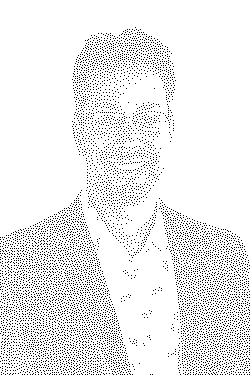
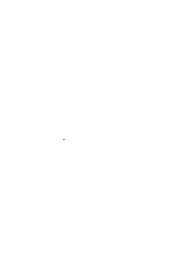

# Blue Noise Stippling

Blue-noise stippling is a technique for converting images into stippled artwork using a modified void-and-cluster algorithm. The algorithm places dots in a way that maintains even spatial distribution (blue noise), preserves tonal structure through importance mapping, and avoids clumps and regular grid patterns to produce visually pleasing results.

## Stippled Image

*Stippled version of the input image using blue-noise distribution.*

## Progressive Stippling GIF

*Animation showing stipples being added progressively over time.*

## About Blue-Noise Stippling

Blue-noise stippling is a method for creating stippled artwork from images. The technique uses an importance map derived from the input image to guide dot placement, ensuring that darker regions receive more dots while maintaining an even spatial distribution. The algorithm employs a toroidal Gaussian repulsion kernel to prevent clumping and create a visually pleasing blue-noise pattern. This results in artwork that preserves the tonal structure of the original image while displaying an aesthetically pleasing, evenly distributed dot pattern that avoids both random clumps and regular grid arrangements.

